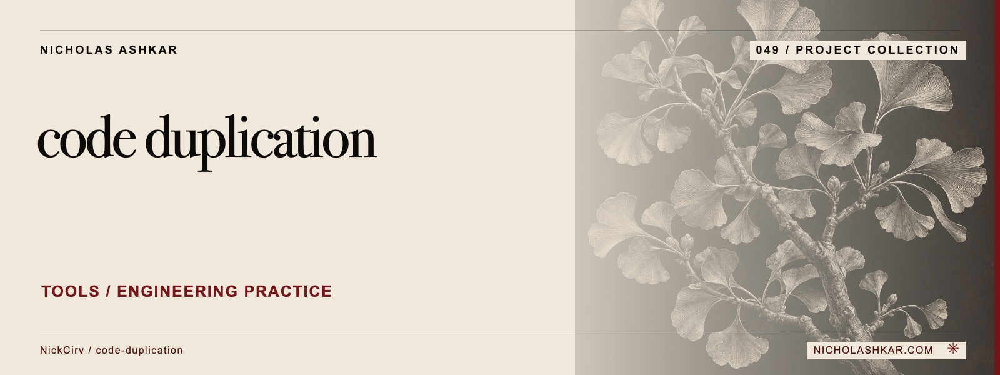

# code-duplication

Finds repeated and similar normalized code blocks across a directory.


<a id="usage"></a>

<a id="scan-src-for-exact-duplicates-default"></a>

<a id="near-duplicates-in-jsts-files-only-10-lines"></a>

<a id="export-to-json"></a>

## What it does

- Language/exclusion controls.
- Exact and partial block hashes.
- Grouped occurrences.
- Duplication statistics.


<a id="install"></a>

## Quickstart

Prerequisites: Node.js `>=20` and npm. The checkout below pins the source used for this documentation.

```sh
git clone https://github.com/NickCirv/code-duplication.git
cd code-duplication
git checkout 8b30c39dc17b5f4af7d364f6bad7b286b87d49e1
node index.js .
```

**Expected behavior (illustrative, not captured):** Prints candidate duplicate groups for the selected files.

Examples are source-inspected, **not runtime-tested**. See the research record for verification gaps.

## Boundaries and data

Normalization and sliding windows compare text, not semantics. Similar generated code and short common patterns can be false positives; review before refactoring.


<a id="ci-gate--fail-if-any-duplicates-found"></a>

## Development

The manifest defines `npm test` as:

```sh
node --test
```

The captured suite is a smoke check, not end-to-end behavior coverage. Examples include “entry is valid JavaScript”. Tests were not run for this documentation revision.

See [implementation and command reference](docs/REFERENCE.md) for the package scripts and inspected interfaces, and [research record](docs/RESEARCH.md) for the pinned source, document decisions and unresolved checks.

## License and contact

See [LICENSE](LICENSE) for the original terms and attribution. Legal text is unchanged.

[Nicholas Ashkar](https://nicholashkar.com/) · [Discuss a project](https://nicholashkar.com/#oxblood-contact)
